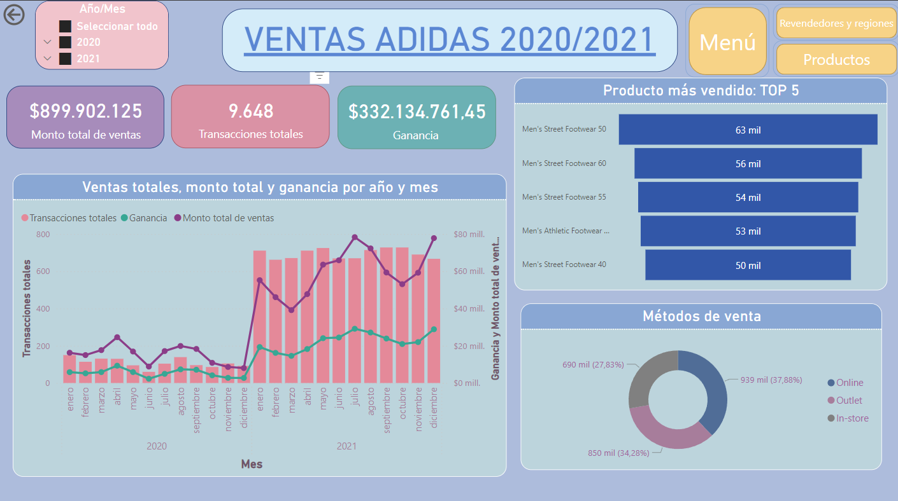
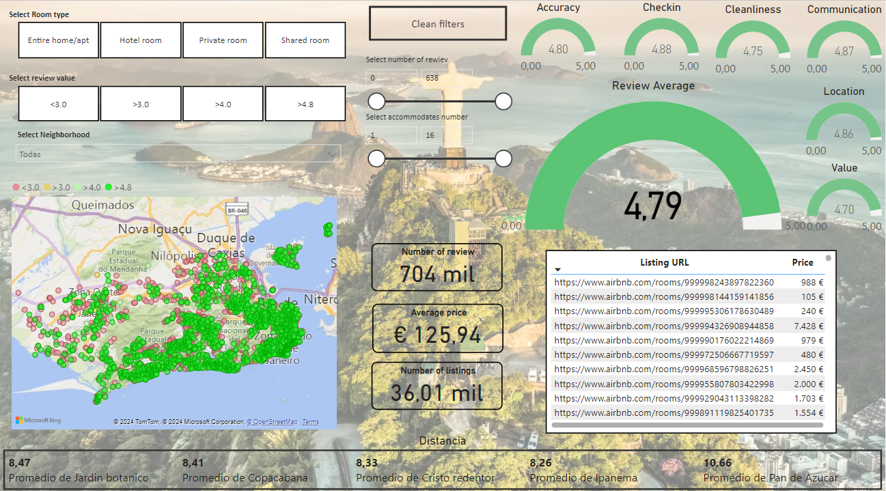

# PowerBi proyects

This repository contains various data analysis projects conducted with Power BI. Below, you can find links to the corresponding dashboards:

1- *Explore 126 Years of Olympic History: Discover the Medal Tally and More!*

In celebration of the 2024 Olympic Games in Paris, I have created an interactive dashboard that allows you to explore Olympic data from 1896 to 2022 in a dynamic and easy way. Dive into the rich history of the Olympics and uncover the details of the medal tallies over the years.

[Link al dashboard](https://app.powerbi.com/view?r=eyJrIjoiNDk3Yjc1OGEtZDk2My00MGUzLTliNmUtYTY1YzQ5NmQ5YjI1IiwidCI6IjhhZWJkZGI2LTM0MTgtNDNhMS1hMjU1LWI5NjQxODZlY2M2NCIsImMiOjl9)

2- *Adidas Sales*

This project was my first project completed in Power BI, and it was part of the final work for the CoderHouse course. It uses a public database on sales from 2020-2021 at Adidas. The project began with data preprocessing to clean the data. If you have any questions about the steps taken, feel free to ask.

[Link al dashboard](https://app.powerbi.com/view?r=eyJrIjoiZTZiMDYwMDctNTIyMS00NDM1LWJkZTQtYjUyMWNiODVlMTZjIiwidCI6IjhhZWJkZGI2LTM0MTgtNDNhMS1hMjU1LWI5NjQxODZlY2M2NCIsImMiOjl9)

3- *Find Your Place*

This dashboard was created as part of a project on Airbnb accommodations in Rio de Janeiro. Its purpose is to help travelers find their ideal accommodation using various filters.

[Link al dashboard](https://app.powerbi.com/view?r=eyJrIjoiN2YzOWE0OTAtNjA0Mi00YzAxLWJkMzgtNGViNTRlOWExNjc2IiwidCI6IjhhZWJkZGI2LTM0MTgtNDNhMS1hMjU1LWI5NjQxODZlY2M2NCIsImMiOjl9)

4- *Sales*

This Power BI dashboard is from a company's sales data. Provides detailed visualizations of sales across different regions and allows users to explore and analyze the data effectively.

[Link al dashboard](https://app.powerbi.com/view?r=eyJrIjoiZDNlODFkOWQtNjA1My00OWQ2LWJjNWUtMmY0YThjNmJlMDY0IiwidCI6IjhhZWJkZGI2LTM0MTgtNDNhMS1hMjU1LWI5NjQxODZlY2M2NCIsImMiOjl9)

